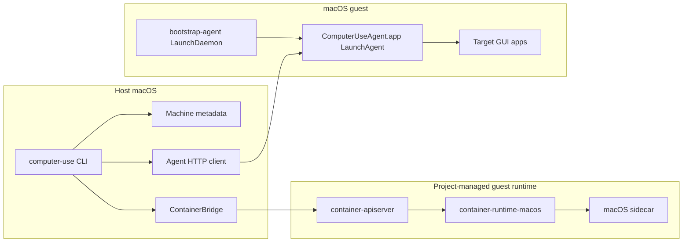

# Architecture

`computer-use-cli` separates macOS guest lifecycle management from GUI
automation. The host CLI delegates guest creation and runtime operations to a
project-managed macOS guest runtime, while the guest-side agent performs screen
capture, accessibility inspection, and input actions from the logged-in user
session.

## System Overview



## Components

Host CLI:

- Creates, starts, stops, inspects, lists, and deletes guest machines.
- Maintains machine metadata under `~/.computer-use-cli/machines/`.
- Forwards agent commands over published TCP or `container_exec`.
- Formats all command responses as JSON.

Guest runtime integration:

- Prepares the pinned guest-runtime binaries under a project-owned runtime root.
- Starts `container-apiserver` with project-owned app and install roots.
- Rejects root mismatches instead of silently reusing another application's
  runtime.
- Provides a raw wrapper through `computer-use runtime container -- ...`.

Guest bootstrap agent:

- Runs as a LaunchDaemon.
- Checks whether the user session and session agent are ready.
- Writes bootstrap status for diagnostics.

Guest session agent:

- Runs as `/Applications/ComputerUseAgent.app` in the `admin` GUI session.
- Listens on `127.0.0.1:7777`.
- Captures screenshots through ScreenCaptureKit.
- Reads accessibility trees through macOS AX APIs.
- Sends input events through CoreGraphics and AX actions.

## Runtime Ownership

Default runtime layout:

```text
~/Library/Application Support/computer-use-cli/container-sdk/0.0.4/
  app/
  install/
    bin/container
```

The CLI does not depend on a globally installed `/usr/local/bin/container`.
The `container` command is an implementation detail exposed through
`computer-use runtime container -- ...` for development and image operations.
Runtime location and version can be overridden with the environment variables
listed in [Usage](usage.md).

## Guest Installation Layout

The guest image installs fixed paths and identities:

```text
/Applications/ComputerUseAgent.app
/usr/local/libexec/computer-use/bootstrap-agent
/Library/LaunchDaemons/io.github.jianliang00.computer-use.bootstrap.plist
/Library/LaunchAgents/io.github.jianliang00.computer-use.agent.plist
/var/run/computer-use/bootstrap-status.json
```

Stable identifiers:

- App bundle id: `com.jianliang00.computer-use-cli`
- Bootstrap LaunchDaemon: `io.github.jianliang00.computer-use.bootstrap`
- Session LaunchAgent: `io.github.jianliang00.computer-use.agent`

These values are part of the permission model. Changing path, bundle id, user,
or code-signing identity can invalidate the authorized image.

## Permission Model

macOS Accessibility and Screen Recording permissions are bound to a stable app
identity in a logged-in user session. The project does not modify the TCC
database at runtime and does not rely on configuration profiles to bypass user
consent.

The supported model is:

1. Install `ComputerUseAgent.app` at the fixed path.
2. Sign it with a stable Developer ID Application identity for release builds.
3. Start a product guest once as `admin`.
4. Grant Accessibility and Screen & System Audio Recording in the guest GUI.
5. Package that state as an authorized image.

Normal users run machines from the authorized image and should not have to grant
permissions in each guest.

## Agent Protocol

The agent exposes HTTP JSON endpoints on the guest loopback interface:

- `GET /health`
- `GET /permissions`
- `POST /permissions/request`
- `GET /apps`
- `POST /state`
- `POST /actions/click`
- `POST /actions/type`
- `POST /actions/key`
- `POST /actions/drag`
- `POST /actions/scroll`
- `POST /actions/set-value`
- `POST /actions/action`

Successful responses return `200`. Protocol errors use a shared JSON shape:

```json
{
  "error": {
    "code": "permission_denied",
    "message": "Missing permissions: accessibility, screenRecording"
  }
}
```

## Snapshot Model

`POST /state` returns a screenshot, accessibility tree, and `snapshot_id`.
Element actions reference elements from a specific snapshot:

- Every state capture creates a new `snapshot_id`.
- `element_id` values are scoped to that snapshot.
- The agent keeps the latest 8 snapshots.
- Snapshot TTL is 60 seconds.
- Expired or unknown snapshots return `snapshot_expired`.

This keeps element actions tied to the UI state that produced them and avoids
reusing stale AX objects.

## Packaging Model

The release workflow publishes:

- Host CLI package: installs `/usr/local/bin/computer-use`.
- Guest kit package: installs the guest app, bootstrap binary, and launchd
  configuration.
- Tarballs for both packages' raw payloads.
- `SHA256SUMS.txt`.

The host package is the normal user-facing artifact. The guest kit is consumed
by the guest-image workflow and is not something users install manually in each
guest VM.
