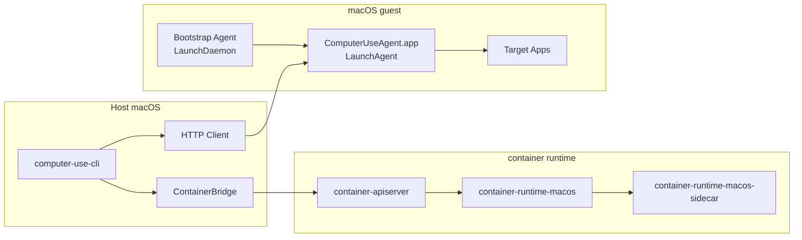

# Computer Use CLI 开发设计

## 1. 系统定义

`computer-use-cli` 是一个运行在 host macOS 上的命令行工具。它负责启动一个 macOS guest、连接 guest 内的 computer-use agent，并把 CLI 命令转换成 UI 自动化动作。

系统由三部分组成：

- host CLI：生命周期管理、命令转发、结果输出
- guest bootstrap：系统启动后的守护逻辑
- guest session agent：运行在登录用户会话中的 UI 自动化服务

本项目只实现 computer-use 能力，不重写 macOS guest runtime。guest 生命周期复用线上发布的 `container` SDK/runtime，但由本项目管理独立的 app root 与 install root；默认不依赖用户已经安装的 `/usr/local/bin/container`，也不复用其他应用的 runtime bundle。

实施任务清单见 [docs/computer-use-cli-todo.md](/Users/bytedance/Code/computer-use-cli/docs/computer-use-cli-todo.md)。

## 2. 第一性原理与不可变约束

### 2.1 computer-use 的最小闭环

一次 computer-use 操作必须同时具备三类能力：

- 观测：读取屏幕内容
- 语义：读取 Accessibility 树
- 执行：注入鼠标键盘和控件动作

这三类能力都依赖 **登录用户的 GUI 会话**，而不是 system daemon。

结论：真正的 computer-use agent 必须运行在 guest 的用户会话内。

### 2.2 guest 生命周期与 UI 自动化是两个问题

启动 VM、镜像构建、网络和日志属于 guest runtime 问题；AX、ScreenCapture 和输入注入属于 UI 自动化问题。

结论：host 侧直接复用 `container` 管理 guest，本项目只在其上增加控制面和 agent。

### 2.3 权限状态绑定进程身份

Accessibility 和 Screen Recording 的授权不绑定“功能”，绑定的是稳定的进程身份：

- app bundle path
- bundle identifier
- code signature
- 登录用户上下文

结论：session agent 必须以固定 app bundle 形式安装到固定路径，并在权限种子镜像中完成一次性人工授权。

### 2.4 传输层选择

系统采用 **HTTP + published TCP port**。

原因：

- session agent 运行在登录用户会话内，HTTP 最容易与该进程形态集成
- HTTP 的可观测性最好，便于健康检查、日志定位和命令行调试
- 动作层与传输层解耦后，HTTP 可以直接承载本系统所需的全部能力

## 3. 最终设计

### 3.1 总体架构



### 3.2 角色分工

#### container SDK runtime

负责：

- 由 `computer-use-cli` 下载并解包线上发布的 `container` SDK release
- 放置在项目独立 runtime root：
  `~/Library/Application Support/computer-use-cli/container-sdk/<version>/`
- 使用项目独立 app root 与 install root 启动 `container-apiserver`
- 为 image 构建和授权镜像注入同源 `container-macos-guest-agent`

不负责：

- 依赖 OpenBox 或其他宿主应用的 bundle
- 依赖用户事先安装的 `/usr/local/bin/container`
- 在检测到其他 root 的 apiserver 已运行时静默混用

#### host CLI

负责：

- 创建、启动、停止、删除 guest
- 暴露统一命令行接口
- 连接 guest agent
- 转换请求和格式化输出

不负责：

- AX 树读取
- 屏幕截图
- 输入事件注入

#### guest bootstrap

负责：

- 在系统启动后检查用户会话是否就绪
- 检查 session agent 是否安装、是否运行
- 输出健康状态和诊断信息

不负责：

- 截图
- AX 遍历
- 输入事件注入
- app 级缓存

#### guest session agent

负责：

- 对外暴露 HTTP JSON API
- 读取运行中应用列表
- 获取 screenshot + AX tree
- 执行 click / type / key / drag / scroll / set-value / action
- 管理权限状态
- 管理 snapshot 和 element 缓存

## 4. 运行时边界

本设计以 `container` 实现为基础，要求如下：

- host 必须是 Apple silicon
- host 系统必须满足 `container` 分支要求的 macOS 版本
- 只能运行 `darwin/arm64` image
- host 运行环境为本地图形会话
- 使用一个 guest 网络附件
- 优先使用 IPv4 `--publish`；当 darwin runtime 不支持 publish 时，host
  侧通过 `container_exec` transport 访问 guest 内 agent

以下能力明确不由 `container` 提供：

- Accessibility 权限管理
- Screen Recording 权限管理
- auto-login 用户配置
- computer-use 动作协议

这些全部由本项目实现。

## 5. 仓库布局

本仓库按如下结构落地：

```text
docs/
  computer-use-cli-technical-plan.md

Sources/
  ComputerUseCLI/
  ContainerBridge/
  AgentProtocol/
  BootstrapAgent/
  ComputerUseAgentApp/
  ComputerUseAgentCore/

images/
  macos/
    Dockerfile
    launchd/
      io.github.jianliang00.computer-use.bootstrap.plist
      io.github.jianliang00.computer-use.agent.plist
    scripts/
      configure-autologin.sh
      seed-authorized-image.sh

Tests/
  ContainerBridgeTests/
  AgentProtocolTests/
  ComputerUseAgentCoreTests/
```

模块职责如下：

- `ComputerUseCLI`：CLI 命令和输出
- `ContainerBridge`：通过项目自带的发布版 `container` SDK CLI 管理 guest
  生命周期
- `AgentProtocol`：请求、响应、错误码、JSON 编解码
- `BootstrapAgent`：LaunchDaemon 进程
- `ComputerUseAgentApp`：登录用户会话中的 app bundle
- `ComputerUseAgentCore`：AX / Screenshot / Input 的核心逻辑

host 侧 machine metadata 固定存放在：

- `~/.computer-use-cli/machines/<machine-name>/machine.json`

`machine.json` 至少包含：

- machine name
- image reference
- sandbox id
- allocated host port
- current status

## 6. guest 安装布局

最终镜像中的安装路径固定如下：

- session agent app bundle
  - `/Applications/ComputerUseAgent.app`
- bootstrap agent binary
  - `/usr/local/libexec/computer-use/bootstrap-agent`
- bootstrap LaunchDaemon
  - `/Library/LaunchDaemons/io.github.jianliang00.computer-use.bootstrap.plist`
- session LaunchAgent
  - `/Library/LaunchAgents/io.github.jianliang00.computer-use.agent.plist`

固定身份如下：

- session agent bundle id
  - `io.github.jianliang00.computer-use.agent`
- bootstrap label
  - `io.github.jianliang00.computer-use.bootstrap`
- session label
  - `io.github.jianliang00.computer-use.agent`

这些值在权限种子镜像发布后不可再改。否则需要重新授权并重新制作种子镜像。

## 7. 用户与登录模型

系统采用单用户模型：

- guest 用户名固定为 `admin`
- 启用自动登录
- session agent 永远运行在 `admin` 的 GUI session 中

原因：

- AX 和 Screen Recording 必须在用户会话内可用
- 单用户模型可以最大限度减少 TCC、路径和会话切换的不确定性

## 8. 镜像设计

### 8.1 镜像分层

镜像分为三层：

1. base image
   - 由项目自带的发布版 `container` SDK 流程准备
   - 提供可运行的 macOS guest 和基础用户环境
2. product image
   - 安装 bootstrap agent、session agent、launchd plist、auto-login 配置
3. authorized image
   - 从 product image 启动一次 guest
   - 手工授予 Accessibility 和 Screen Recording
   - 验证 agent 可用后 commit 形成最终可分发镜像

### 8.2 最终使用的镜像

开发和运行都使用 authorized image，不直接使用 product image。

原因：

- 权限状态必须作为镜像内容的一部分固化
- 避免每次创建新 guest 时都重新人工授权

### 8.3 镜像构建流程

固定流程如下：

1. 用项目 runtime wrapper 准备 base image，例如
   `swift run computer-use runtime container -- macos prepare-base ...`
2. 构建本项目 image：

```bash
swift run computer-use runtime container -- build \
  --platform darwin/arm64 \
  -f images/macos/Dockerfile \
  -t local/computer-use:product \
  images/macos
```

3. 启动 `local/computer-use:product`
4. 在 guest 中手工确认：
   - auto-login 生效
   - `ComputerUseAgent.app` 已启动
   - Accessibility 已添加并授权
   - Screen Recording 已添加并授权
5. host 侧执行：

```bash
swift run computer-use runtime container -- commit <container-id> local/computer-use:authorized
```

6. 之后所有 `machine create` 都使用 `local/computer-use:authorized`

## 9. 启动链路

### 9.1 machine start

`computer-use machine create` 必须先完成两件事：

1. 创建 sandbox 元数据
2. 分配一个空闲的 host IPv4 端口，并将其持久化到本项目的 machine metadata 中

`computer-use machine start` 固定执行以下动作：

1. 通过 `ContainerBridge` 启动 sandbox
2. 使用 `machine create` 时已持久化的 host port 建立 `127.0.0.1:<host-port> -> 127.0.0.1:7777` 的 publish
3. 以 GUI 模式展示 guest 窗口
4. 轮询 guest agent `/health`
5. 返回 machine ready

### 9.2 guest 内启动顺序

guest 启动后固定顺序如下：

1. macOS 启动
2. `admin` 自动登录
3. bootstrap LaunchDaemon 启动
4. session LaunchAgent 启动
5. `ComputerUseAgent.app` 启动并监听本地 HTTP 端口
6. bootstrap 写出健康状态

### 9.3 监听地址

session agent 固定监听：

- guest bind: `127.0.0.1:7777`

host 固定 publish：

- host bind: `127.0.0.1:<allocated-port>`
- guest target: `127.0.0.1:7777`

`machine inspect` 和 `agent ping` 必须能返回这个 host 端口。

## 10. 权限策略

### 10.1 最终策略

权限策略只有一条：

**不在运行时修改 TCC 数据库，不通过 profile 试图绕过授权；只通过稳定 app 身份 + 一次性人工授权 + 种子镜像固化权限。**

### 10.2 必须满足的条件

只有同时满足以下条件，权限状态才可复用：

- `ComputerUseAgent.app` 的路径不变
- bundle id 不变
- code signature requirement 不变
- 授权用户仍为 `admin`
- 授权后的 TCC 数据随 image 一起被 commit

### 10.3 权限要求

必须预授权以下权限：

- Accessibility
- Screen Recording

如果未授权，session agent 必须：

- 在 `/permissions` 明确返回缺失项
- 在动作请求中返回确定性的错误码
- 不尝试继续执行动作

## 11. 日志与健康状态

日志路径固定如下：

- bootstrap log
  - `/var/log/computer-use-bootstrap.log`
- session log
  - `/Users/admin/Library/Logs/ComputerUseAgent.log`
- bootstrap status
  - `/var/run/computer-use/bootstrap-status.json`

`bootstrap-status.json` 至少包含：

```json
{
  "bootstrapped": true,
  "user": "admin",
  "session_ready": true,
  "agent_installed": true,
  "agent_running": true,
  "agent_port": 7777
}
```

host CLI 的 `agent doctor` 必须展示：

- sandbox 是否运行
- published host port
- bootstrap 是否就绪
- session agent 是否就绪
- 权限是否完整

## 12. agent API 规范

### 12.1 通用规则

- 协议为 HTTP + JSON
- 所有成功响应返回 `200`
- 业务错误返回 `4xx`
- 进程级异常返回 `5xx`

统一错误格式：

```json
{
  "error": {
    "code": "permission_denied",
    "message": "Accessibility permission is not granted"
  }
}
```

### 12.2 路由

#### `GET /health`

返回：

```json
{
  "ok": true,
  "version": "0.1.0"
}
```

#### `GET /permissions`

返回：

```json
{
  "accessibility": true,
  "screen_recording": true
}
```

#### `GET /apps`

返回用户可见应用列表。每项至少包含：

- `bundle_id`
- `name`
- `pid`
- `is_frontmost`

#### `POST /state`

请求：

```json
{
  "bundle_id": "com.apple.TextEdit"
}
```

如果 `bundle_id` 为空，则取 frontmost app。

响应：

```json
{
  "snapshot_id": "snap-001",
  "app": {
    "bundle_id": "com.apple.TextEdit",
    "name": "TextEdit",
    "pid": 123
  },
  "window": {
    "title": "Untitled",
    "bounds": { "x": 120, "y": 80, "width": 1024, "height": 768 }
  },
  "screenshot": {
    "mime_type": "image/png",
    "base64": "<...>"
  },
  "ax_tree": {
    "root_id": "ax-1",
    "nodes": []
  }
}
```

#### `POST /actions/click`

请求二选一：

- 坐标点击
- 元素点击

```json
{
  "x": 100,
  "y": 200,
  "button": "left",
  "click_count": 1
}
```

或：

```json
{
  "snapshot_id": "snap-001",
  "element_id": "ax-42",
  "button": "left",
  "click_count": 1
}
```

#### `POST /actions/type`

```json
{
  "text": "hello"
}
```

#### `POST /actions/key`

```json
{
  "key": "Return"
}
```

#### `POST /actions/drag`

```json
{
  "from": { "x": 100, "y": 100 },
  "to": { "x": 400, "y": 300 }
}
```

#### `POST /actions/scroll`

```json
{
  "snapshot_id": "snap-001",
  "element_id": "ax-21",
  "direction": "down",
  "pages": 1
}
```

#### `POST /actions/set-value`

```json
{
  "snapshot_id": "snap-001",
  "element_id": "ax-12",
  "value": "new value"
}
```

#### `POST /actions/action`

```json
{
  "snapshot_id": "snap-001",
  "element_id": "ax-12",
  "name": "AXPress"
}
```

## 13. snapshot 与 element 规则

为保证 screenshot 和 AX tree 的一致性，所有元素操作都必须基于 `snapshot_id`。

固定规则如下：

- 每次 `/state` 生成一个新的 `snapshot_id`
- `element_id` 只在对应 `snapshot_id` 下有效
- agent 保留最近 8 个 snapshot
- snapshot TTL 为 60 秒
- 过期或不存在的 `snapshot_id` 返回 `snapshot_expired`

这样可以避免 AX 对象跨快照复用导致的失效和误操作。

## 14. CLI 规范

CLI 固定提供以下命令：

```bash
computer-use machine create --name devbox --image local/computer-use:authorized
computer-use machine start --machine devbox
computer-use machine inspect --machine devbox
computer-use machine stop --machine devbox
computer-use machine rm --machine devbox
computer-use machine logs --machine devbox

computer-use agent ping --machine devbox
computer-use agent doctor --machine devbox

computer-use apps list --machine devbox
computer-use state get --machine devbox --bundle-id com.apple.TextEdit
computer-use click --machine devbox --x 100 --y 200
computer-use click --machine devbox --snapshot snap-001 --element ax-42
computer-use type --machine devbox --text "hello"
computer-use key --machine devbox --key Return
computer-use drag --machine devbox --from 100,100 --to 400,300
computer-use scroll --machine devbox --snapshot snap-001 --element ax-21 --direction down --pages 1
computer-use set-value --machine devbox --snapshot snap-001 --element ax-12 --value "new value"
computer-use action --machine devbox --snapshot snap-001 --element ax-12 --name AXPress
```

输出规则：

- 默认输出紧凑文本
- `--json` 输出完整 JSON
- `state get --output-image <path>` 可以把 screenshot 额外保存到本地文件
- `machine create` 使用 `--name`
- 其他所有作用到已有 guest 的命令统一使用 `--machine <name>`

## 15. 组件实现要求

### 15.1 ContainerBridge

必须封装以下能力：

- create sandbox
- inspect sandbox metadata
- start sandbox
- stop sandbox
- remove sandbox
- query logs
- resolve published host port

host CLI 不直接散落调用底层 `container` SDK CLI/API。

### 15.2 BootstrapAgent

必须实现：

- 会话就绪检测
- session agent 安装检测
- session agent 运行检测
- 状态文件写出
- 日志写出

不实现任何 UI 自动化逻辑。

### 15.3 ComputerUseAgentApp

必须使用：

- AppKit
- ApplicationServices
- ScreenCaptureKit

动作实现必须全部集中在 `ComputerUseAgentCore`，app 层只负责：

- HTTP server
- 生命周期
- 日志
- 权限状态对外暴露

## 16. 开发顺序

开发严格按以下顺序进行：

### Phase 1：host 生命周期闭环

交付：

- `machine create`
- `machine start`
- `machine inspect`
- `machine stop`
- `machine rm`
- `machine logs`

验收：

- 能启动并显示 guest GUI

### Phase 2：guest agent 最小服务

交付：

- `GET /health`
- `GET /permissions`
- `GET /apps`
- `agent ping`
- `apps list`

验收：

- host CLI 可稳定连接 guest agent

### Phase 3：状态采集

交付：

- `/state`
- screenshot
- AX tree
- snapshot cache

验收：

- `state get` 可返回可用的 screenshot 和元素树

### Phase 4：动作执行

交付：

- click
- type
- key
- drag
- scroll
- set-value
- action

验收：

- 能稳定驱动 TextEdit、Finder、Safari 的基础交互

### Phase 5：种子镜像与权限固化

交付：

- product image
- authorized image
- 授权流程脚本和文档

验收：

- 新建 guest 后无需再次人工授权

## 17. 最终验收标准

满足以下条件即视为完成：

1. 能从 authorized image 创建 guest
2. `machine start` 后 60 秒内 agent 可连通
3. `apps list` 返回运行中应用
4. `state get` 返回 screenshot、AX tree、snapshot_id
5. 所有动作接口可执行并返回确定性结果
6. 权限缺失时系统返回明确错误，而不是 silent failure
7. 不需要手工进入 guest 重新授权

## 18. 设计结论

本项目的最终设计只有一条主线：

- 用 `container` 负责 macOS guest 生命周期
- 用 authorized image 固化用户会话和权限状态
- 用 `ComputerUseAgent.app` 在 guest 用户会话中执行 computer-use
- 用 host CLI 通过 HTTP published port 调用 agent

开发实施围绕这条主线展开。
